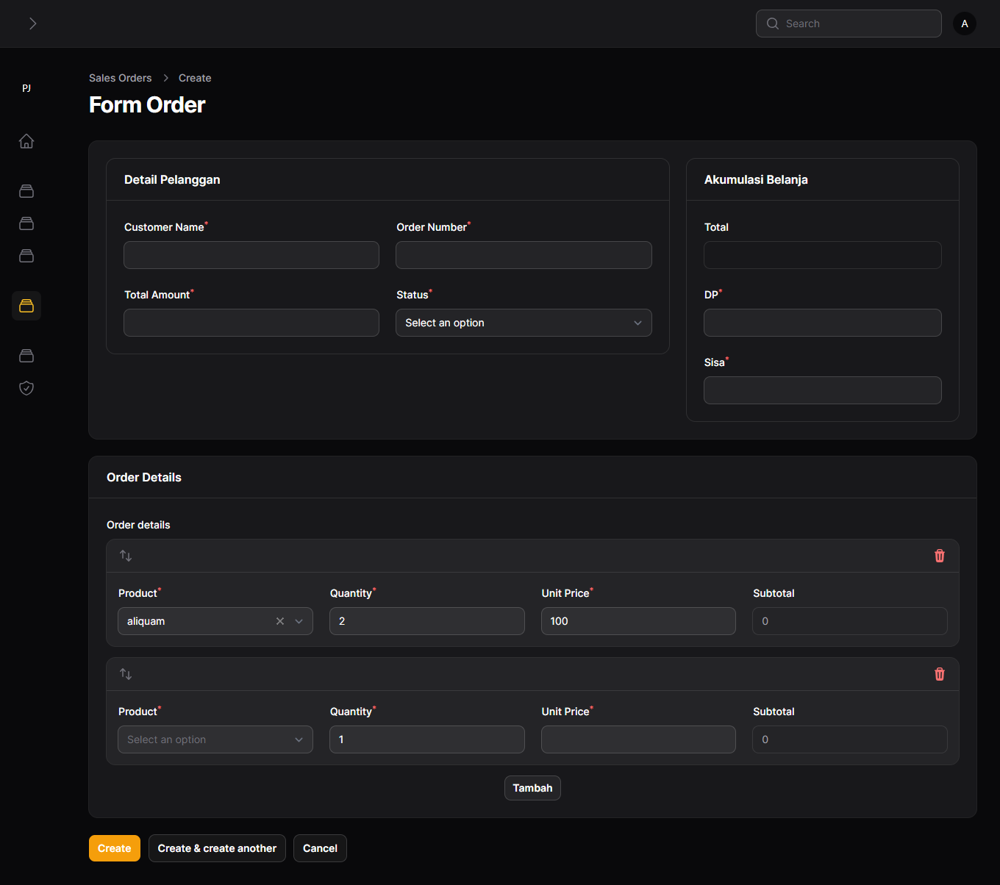

<h1>Langkah Langkah filament panel multi tenant dan shield oke</h1>
 
<ol>
    <li><pre>composer create-project laravel/laravel:^10.0 nama_proyek</pre></li>
    <li><pre>composer require filament/filament:"^3.2" -W</pre></li>
    <li><pre>php artisan filament:install --panels</pre></li>
    <li><pre>php artisan migrate</pre></li>
    <li><pre>php artisan make:filament-user</pre></li>
    <li><pre>composer require spatie/laravel-permission</pre></li>
    <li><pre>php artisan vendor:publish --provider="Spatie\Permission\PermissionServiceProvider"</pre>
</li>
    <li>
        <pre>php artisan optimize:clear</pre> 
        # or 
        <pre>php artisan config:clear</pre> 
    </li>
    <li><pre>php artisan migrate</pre></li>
    <li>
        Tambahkan  pada model User 
        <pre>use HasRoles</pre>;
    </li>
    <li>
        Install Shield 
        <pre>composer require bezhansalleh/filament-shield</pre>
    </li>
   
    <li>
        <pre>php artisan vendor:publish --tag=filament-shield-config</pre>
    </li>

    <li>
        Tambahkan pada AdminPanelProvider.php 
        ->plugins([
            \BezhanSalleh\FilamentShield\FilamentShieldPlugin::make()
        ]);
    </li>
    <li>
        Jalankan shieldnya agar hak aksenya berjalan 
        php artisan shield:install
    </li>
    <li>
        pada model yang berelasi ke team tambahkan belongsto 
        contoh :  
        <pre>
        public function team(): BelongsTo 
        { 
            return $this->belongsTo(\App\Models\Team::class); 
        } 
        </pre>

pada model team tambahkan hasmany atau belongstomany 

<pre>
public function members(): BelongsToMany 
    { 
        return $this->BelongsToMany(User::class); 
    } 
    public function dataalamat(): HasMany 
    { 
        return $this->HasMany(DataAlamat::class); 
    } 
    public function categories(): HasMany 
    { 
        return $this->HasMany(DataAlamat::class); 
    } 

    public function role(): HasMany 
    { 
        return $this->HasMany(Role::class); 
    } 
    </pre>

    </li>

<li>
    Buat resource baru 
    <pre>php artisan make:filament-resource Category --generate --simple</pre> 
    --simple adalah opsional
</li>
<li>jalanakan ulang php artisan shield:install jika migrasi refresh</li>
<li>
    untuk role atau yang lainnya jika diperlukan tambahkan kode ini 
     public static ?string $tenantOwnershipRelationshipName = 'team'; 
    protected static  ?string $tenantRelationshipName = 'role'; 
</li>
<li>
tambahkan ini pada Spatie\Permission\Models\Role 
    public function team(): BelongsTo 
    { 
        return $this->belongsTo(\App\Models\Team::class); 
    } 
</li>
<li>
Tambahkan ini di .env untuk upload file 
<pre>FILESYSTEM_DRIVER=local</pre>
</li>
<li>
    Setting faker ke bahasa indonesia 
    Setting di env 
    <pre>FAKER_LOCALE=id_ID</pre>
    Setting di config/app.php 
    <pre>'faker_locale' => env('FAKER_LOCALE', 'en_US'),</pre>
</li>
<li>
    https://www.rosehosting.com/blog/how-to-install-aapanel-on-debian-11/ 
</li>

<li>
<h1>Install Vps</h1>

Prerequisites
A server with Debian 11 as OS
User privileges: root or non-root user with sudo privileges
Step 1. Update the System
Update the system packages to the latest versions available. Execute the following command:

<pre>sudo apt-get update -y && sudo apt-get upgrade -y</pre>

Step 2. Download aaPanel script
To download and set the aaPanel script executable, use the following commands:

<pre>wget -O install.sh http://www.aapanel.com/script/install-ubuntu_6.0_en.sh</pre>

<pre>sudo chmod +x install.sh</pre>

Step 3. Install aaPanel 
To install the aaPanel execute the following command: 

<pre>sudo bash install.sh</pre>

You will be asked if you want to install the aaPanel into the /www directory on your server: 

+---------------------------------------------------------------------- 
| aaPanel 6.x FOR CentOS/Ubuntu/Debian 
+---------------------------------------------------------------------- 
| Copyright © 2015-2099 BT-SOFT(http://www.aapanel.com) All rights reserved. 
+---------------------------------------------------------------------- 
| The WebPanel URL will be http://SERVER_IP:7800 when installed. 
+---------------------------------------------------------------------- 

Do you want to install aaPanel to the /www directory now?(y/n): Y
Once you confirm, the installation will start and it will take up to 3 minutes. You will see the following output after successful installation:

# Congratulations! Installed successfully! 

aaPanel Internet Address: https://YourServerIP:7800/64b21d3e 
aaPanel Internal Address: https://YourServerIP:7800/64b21d3e 
username: zjs6ojyz 
password: 7cf519ed 
Warning: 
If you cannot access the panel, 
release the following port (7800|888|80|443|20|21) in the security group 
================================================================== 
Time consumed: 2 Minute! 

</li>
<li>
htacess untuk vps agar tidak perlu mengakses folder public http://ip-vps/public menjadi http://ip-vps 
Buat File htacess di root proyek dan tuliskan kode di bawah ini 
<pre>
<IfModule mod_rewrite.c> 
RewriteEngine On 
RewriteRule ^(.*)$ public/$1 [L] 
 </IfModule>  
 </pre>
</li>  
<li>
<h1>Install Composer di VPS</h1>

<pre>sudo -u www composer install</pre>

</li>
<li>
<h1>Install Ekstensi PHP</h1>

    ke menu App Store-> PHP yang terinstall -> Install Extensions

</li>
<li>
<h1>Terminal </h1>

    ke menu File -> terminal

</li>
<li>
<h1>Ekstensi Vs Code ? Cursor Untuk Remote Server</h1>

SFTP/FTP sync

</li>
<li>
<h2>Remote File dari cursor/vscode dengan ekstensi SFTP dari Natizyskunk dan sftp FS dari Kelvin</h2>

Buat masing Masing config di volder .vscode/sftp.json dan ssh.json

<pre>
 "name": "Nama Proyek",
    "host": "ip/192.168.1.123",
    "protocol": "ssh", //jika ftp ganti jadi ftp jika vps ganti jadi sftp
    "port": 22,
    "secure": true,
    "username": "usernamevps",
    "password": "Password vps",
    "remotePath": "folder yang diremote",
    "uploadOnSave": true
</pre>

Aktifkan pengaturan write pada folder target di vps dengan atau sudo chmod 777
</li>
<li>
<h2>Konek Database</h2>

Install Ekstensi "Database Client" dari cweijan lalu aktifkan icon database pada sidebar dan buat koneksi baru

</li>
</ol>
